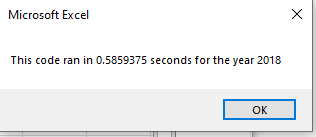

# Stock-Analysis

## Everyone is *Going Green* Including Steve's Parents' Stock Options!
#### Is DAQO everything their heart could desire? How does the competitve green energy market compare?
###### How did the coding for this process go and how to improve it??

By assisting financial advisor, Steve, we can help make the best suggestions for his parents financial future and still stay true to their promotion of renewable green energy. By making a few analyses of a dozen green energy stocks in 2017 and 2018 we can make strong comparisons. The coding for this process has been refactored for efficiency. By streamlining the coding process script times are reduced. This VBA format of coding is the chosen method due to the versatilty of a reusable code that can be reused for a change of stocks. 

### An overview of Green Stocks Analyses in 2018
##### Will DAQO's performance make Steve's Parents flip over like a *DQ BLIZZARD*?

### The Output of VBA Coding work

## 2017 Overview
**The script times for running the Original coding for 2017 analysis:

**Refining and **refactoring the 2017 analysis code

## 2018 Overview
**The script times for running the Original coding for 2018 analysis:

**Refining and **refactoring the 2018 analysis code

There are a couple pros and cons of refactoring code. In this situation I would say there is an advantage for refactoring to enhance running script times for analyses. In a larger data set I would assume this advantage could be more significant. On the whole, refactoring has its advantages in the field for the very pliable reusablity factor. Whole data sets can change but codes can simply be set to run over and over throughout the changes. This is a great advantage for those working with similar queries on a regular basis. The downside may be the incredible ease in which codes can be tampered with and broken. Without sunstantial commentary throughout the work process the tiniest detail edit can halt all progress. 

##### Steve, my friend, may I suggest some diversification of your parent's stock portfolio. If they prefer to place their money on personal favorites it may greatly improve the health of their financial future to drop their *hot eats and cool treats* DQ and strap on their tennis shoes and RUN to greater heights. 
